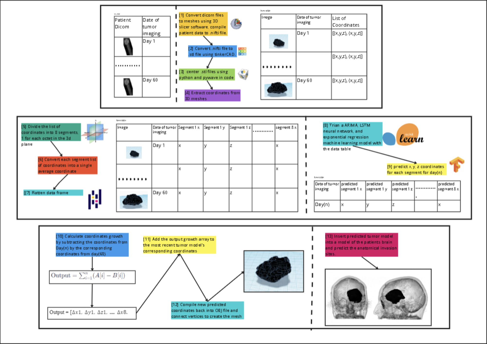
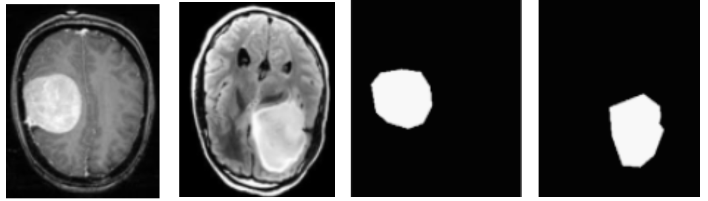
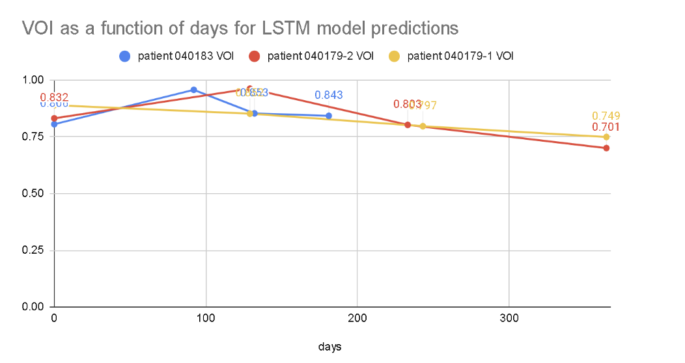
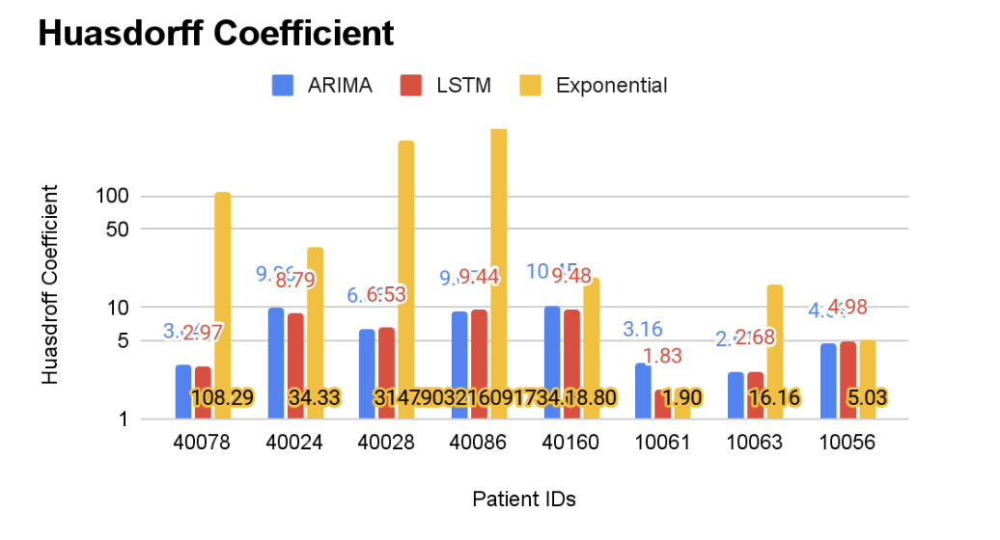
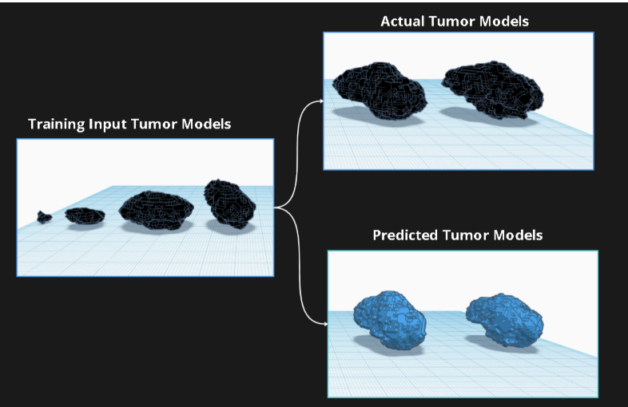
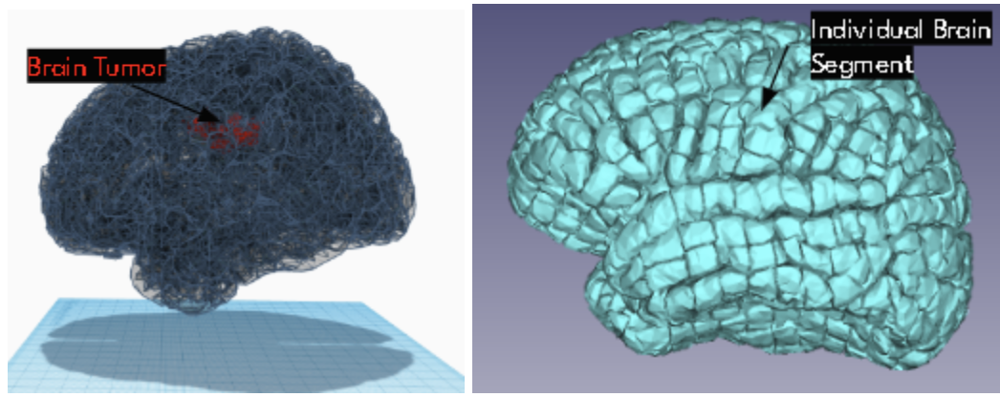

# 🧠 Predictive Modeling of Brain Tumor Evolution and Anatomical Invasion

A 3D time series forecasting system that predicts future brain tumor growth and anatomical invasion sites from sequential DICOM MRI scans — built to assist oncologists in treatment planning, radiation therapy, and surgical design.

> **Author:** Akhilesh Kanmanthreddy  
> **School:** Saginaw Arts and Sciences Academy  
> **Competition:** ISEF 2024

---

## 📋 Table of Contents

- [Overview](#overview)
- [How It Works](#how-it-works)
- [Models](#models)
- [Results](#results)
- [Installation](#installation)
- [Usage](#usage)
- [Dataset](#dataset)
- [Metrics](#metrics)
- [Future Work](#future-work)

---

## Overview

Traditional tumor growth modeling relies on partial differential equations (PDEs), which are slow, power-intensive, and prone to inaccuracies. This project replaces that approach with machine learning-based time series forecasting to:

- Compile **3D tumor models** from 2D MRI segmentations (DICOM files)
- **Forecast future tumor growth** in 3D coordinate space
- **Predict anatomical invasion sites** by mapping predicted tumors onto the Yale Brain Atlas

The LSTM neural network iteration achieved:
- **84.2%** average Volume Overlap Index (VOI)
- **5.84mm** average Hausdorff distance
- **16.76%** average volume % difference
- **90%** anatomical invasion prediction accuracy

---

## Pipeline Overview


*Data transformation → Training → Predicting/Forecasting → Testing*

---

## How It Works

The software pipeline has four main stages:

### 1. Data Transformation
- Patient DICOM MRI files are loaded and converted to 3D mesh models using **3D Slicer**
- Tumor boundaries are segmented from each MRI slice using a trained **Mask R-CNN**
- Segmented slices are compiled into a **3D coordinate-based tumor model** per imaging session


*Left: Raw MRI scan. Right: Tumor segmentation mask produced by Mask R-CNN.*

### 2. Data Preprocessing
- Each patient's time series of 3D tumor models is stored as a Pandas DataFrame
- The 3D coordinate set for each tumor is split into **8 octant segments** (one per region of the 3D plane)
- Each segment's coordinates are averaged into a single representative coordinate per time point

### 3. Forecasting
- Three time series models are trained on the coordinate history for each segment:
  - **ARIMA** — autoregressive + moving average model
  - **LSTM Neural Network** — recurrent network capable of learning long-range dependencies
  - **Exponential Regression** — curve-fitting model using Y = A·e^(bx)
- Each model predicts the future (x, y, z) coordinates for each octant segment
- The predicted coordinate deltas are added to the most recent tumor model to generate the predicted future tumor

### 4. Testing & Anatomical Mapping
- Predicted tumor models are compared to actual tumor models using three evaluation metrics
- Both the predicted and actual tumor models are inserted into the **Yale Brain Atlas** to identify which anatomical brain regions each tumor intersects
- Intersection accuracy is computed between predicted and actual invasion sites

---

## Models

| Model | Description |
|---|---|
| **ARIMA** | Classical statistical model; captures trend (AR) and noise shocks (MA). Parameters: (p, d, q) |
| **LSTM** | Recurrent neural network with memory cells, input/output/forget gates for long-range pattern learning |
| **Exponential Regression** | Curve-fitting model using Y = A·e^(bx); fast but limited for complex spatial data |

---

## Results

### Average Performance Across All Models

| Metric | ARIMA | LSTM | Exponential |
|---|---|---|---|
| Hausdorff Distance (mm) | 6.16 | **5.84** | 108.29 |
| Volume Overlap Index | 84.3% | **84.2%** | 45.6% |
| Volume % Difference | 28.6% | **16.7%** | 95.7% |

**LSTM outperformed ARIMA and Exponential models overall.** The Exponential model performed poorly due to its inability to model non-monotonic 3D growth patterns.

### Anatomical Invasion Accuracy (LSTM)

| Patient ID | Accuracy |
|---|---|
| 40078 | 91.04% |
| 40024 | 89.47% |
| 40028 | 95.35% |
| 40086 | 86.67% |
| 40160 | 84.62% |
| 10061 | 93.55% |
| 10063 | 81.82% |
| 10056 | 91.31% |
| **Average** | **~90%** |

### Long-Term Prediction Accuracy (LSTM VOI over time)
The LSTM model's VOI starts around **82%**, peaks around **94%** at ~100 days, then gradually declines to ~**70%** at ~350 days — indicating the model is most reliable for short-to-medium term predictions.


*LSTM Volume Overlap Index as a function of days after first prediction (3 patients).*


*Hausdorff coefficient comparison across ARIMA, LSTM, and Exponential models per patient.*


*Volume Overlap Index comparison across all three models per patient.*


*Example predicted (blue) vs. actual (black) 3D tumor models across patients and models.*


*Predicted tumor model (red) overlaid on Yale Brain Atlas segments (cyan).*

---

## Installation

```bash
# Clone the repository
git clone https://github.com/<your-username>/brain-tumor-prediction.git
cd brain-tumor-prediction

# Install Python dependencies
pip install tensorflow keras pandas matplotlib pywave pywavefront

# Open the main notebook in Google Colab
# (Google Drive mount required for dataset access)
```

**External tools required:**
- [3D Slicer](https://www.slicer.org/) — for DICOM to 3D mesh conversion
- [MakeSense.ai](https://www.makesense.ai/) — for manual tumor segmentation (training data)
- [TinkerCAD](https://www.tinkercad.com/) — for STL file processing

---

## Usage

1. **Prepare your DICOM files** — organize patient MRI sessions chronologically
2. **Segment tumors** — run the Mask R-CNN segmentation model on each MRI slice
3. **Convert to 3D models** — use 3D Slicer to compile segmentations into DICOM Segmentation Objects
4. **Run the forecasting notebook** — open the Google Colab notebook and mount your Drive
5. **Choose a model** — select ARIMA, LSTM, or Exponential for forecasting
6. **View predictions** — the software outputs a predicted 3D tumor model and anatomical invasion report

📓 **Main Notebook:** [Google Colab Link](https://colab.research.google.com/drive/1X2GmOsBacOL_p5_2zRKhgLbMSDl2SOWa)

---

## Dataset

Patient data sourced from the **MoLab Brain Metastasis Dataset**:  
🔗 https://molab.es/datasets-brain-metastasis-1/?type=metasrd

| Patients | Age Range | Sessions per Patient | Outcome |
|---|---|---|---|
| 11 total | 47–77 years | 3–8 MRI sessions | All deceased |

---

## Metrics

| Metric | Description | Goal |
|---|---|---|
| **Volume Overlap Index (VOI)** | Volume of 3D intersection between predicted and actual tumor (0–1) | ≥ 0.90 |
| **Hausdorff Distance** | Largest distance in mm between predicted and actual tumor surface | Minimize |
| **Volume % Difference** | Percent error between predicted and actual tumor volume | ≤ 10% |
| **Anatomical Invasion Accuracy** | % of brain atlas segments correctly predicted as invaded | Maximize |

---

## Future Work

- **Larger dataset** — training on more patients with more imaging sessions would improve long-term prediction accuracy
- **Transformer-based models** — exploring attention mechanisms for better spatiotemporal modeling
- **Automatic segmentation pipeline** — reducing manual segmentation dependency
- **Clinical validation** — partnering with medical institutions to validate predictions on real patient outcomes
- **Web application** — deploying a user-friendly interface for oncologists to upload scans and receive predictions

---

## References

- MoLab Brain Metastasis Dataset: https://molab.es/datasets-brain-metastasis-1/
- Mask R-CNN base implementation: https://github.com/pysource7/utilities
- Yale Brain Atlas used for anatomical mapping
- LSTM architecture reference: https://en.wikipedia.org/wiki/Long_short-term_memory
